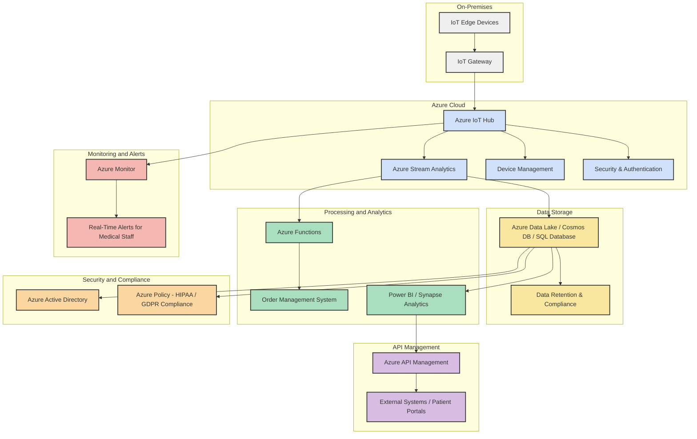

📁 **Project File Changes**

This section outlines the modifications made to various project files during the development process. Below is a list of the files that have been updated:

📄 **2_real.md** - Contains updates related to the real-time data processing module.

📄 **3_environments.md** - Includes changes to the environment configuration settings.

📄 **4_ui.md** - Details the adjustments made to the user interface components.

📄 **5_formulas.md** - Lists the new and updated formulas used in the project.

📄 **6_Symbols.md** - Documents the changes to the symbol definitions.

📄 **7_Semblance.md** - Describes the updates to the semblance analysis algorithms.

📄 **README.md** - Provides an overview of the project and the recent changes.


Here’s a Mermaid chart for the system architecture based on the provided requirements:


```

### Explanation

- **On-Premises (Clinic Site)**: IoT Edge Devices push data to the IoT Gateway, which connects to Azure.
- **Azure Cloud**: IoT Hub ingests data, processes it with Stream Analytics, and uses device management for upkeep.
- **Data Storage**: Raw and processed data is stored in Azure Data Lake, Cosmos DB, and SQL Database.
- **Processing and Analytics**: Azure Functions automate tasks, and Power BI/Synapse Analytics visualize data for insights.
- **Monitoring and Alerts**: Azure Monitor tracks system health and triggers real-time alerts.
- **API Management**: Manages API access for secure integration with external systems.
- **Security and Compliance Layer**: Azure AD manages access, and Azure Policy ensures compliance with regulations like HIPAA and GDPR. 

This layout provides a comprehensive view for a buildable, scalable architecture.